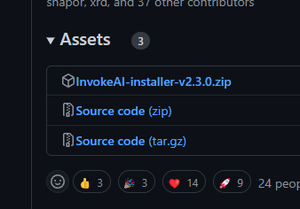

# Getting Started

!!! acstract "概要"
    AUTOMATIC1111版についで2番目にStar数が多いツール  
     - ChakraUIによる美麗なUI  
     - Unified Canvasといった使いやすい機能  
     - ショートカットキー  
     など、機能性だけでなくUI/UXともに優れている。  
    専用のDiscordサーバーもあり、サポートも手厚い

## インストール
1. [GitHubのリリース](https://github.com/invoke-ai/InvokeAI/releases/latest)から最新のものをダウンロードする。  

2. ダウンロードしてきたファイルを展開する。  
  
この段階ですでに使いたいドライブがある場合はフォルダごと移動させる。  
展開したあとに、このようなファイル構成になっていれば大丈夫です。  

3. `environment.bat`というファイルがあるので実行する。  
このファイルの実行が終えた時点ですでに環境が整っています。
4. [好きなモデルを使用する](#_3)からモデルのインストールを行います。 
5. `run.bat`を実行します。  
時間がかかるので少し待ちましょう。  
6. `Running on local URL: http://127.0.0.1:7860`のような表示が現れたら実行完了です。
  
7. [localhost](http://127.0.0.1:7860)にアクセスします。