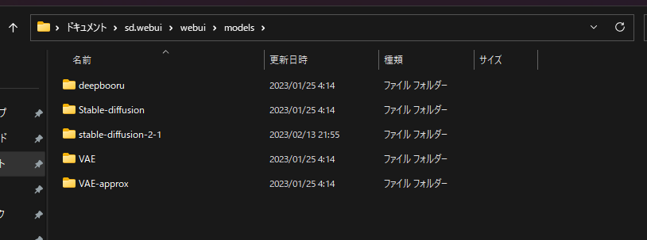

# stable-diffusion-webui

[](https://github.com/AUTOMATIC1111/stable-diffusion-webui)    

:::tip 概要
現在のStable Diffusionをローカルで利用する際のツールで、もっともStar数が多いリポジトリ。  
Gradioというフレームワークを使用しているためUIには多少難があるが、情報が多い。  
拡張機能をふんだんに使いたい方向け
:::

## インストール
1. [GitHubのリリース](https://github.com/AUTOMATIC1111/stable-diffusion-webui/releases/latest)から最新のものをダウンロードする。  

2. ダウンロードしてきたファイルを展開する。  
  
この段階ですでに使いたいドライブがある場合はフォルダごと移動させる。  
展開したあとに、このようなファイル構成になっていれば大丈夫です。  

3. `environment.bat`というファイルがあるので実行する。  
このファイルの実行が終えた時点ですでに環境が整っています。
4. [好きなモデルを使用する](#_3)からモデルのインストールを行います。 
5. `run.bat`を実行します。  

時間がかかるので少し待ちましょう。  
モデルがない場合は
:::caution
Can't run without a checkpoint. Find and place a .ckpt or .safetensors file into any of those locations. The program will exit.  
checkpointがないと実行できません。 .ckptまたは.safetensorsファイルを見つけて、そのいずれかを配置します。プログラムを終了します。
:::
と表示されます。

6. `Running on local URL: http://127.0.0.1:7860`のような表示が現れたら実行完了です。
  
7. [localhost](http://127.0.0.1:7860)にアクセスします。


## アップデート
1日1回どころか、**数分に1回**の頻度でアップデートが入ることがあります。  
しかし、毎回のようにアップデートをしていると致命的なバグを引き当ててしまいます。  
慣れている方や、開発者などリスクを理解している方以外はあまりオススメしません。  
入門者の方や怖いという方は、2週間に1回程度。  
あるいは周りの知っている方に安定してるかどうかを聞いてから行うとよいでしょう。  

1. `run.bat`や`enviroment.bat`が含まれるフォルダへ移動します。
2. `update.bat`を実行します。
3. アップデートが完了すると、`続行するには何かキーを押してください...`という表示が出ます。

4. 適当なキーを押すとアップデートが終了し、黒い画面が閉じます。
5. そのまま`run.bat`を実行すると、アップデートが完了した状態で起動します。


## 好きなモデルを使用する
stable-diffusion-webuiでは自分の好きなモデルを使用することができます。
好みに応じてモデルを使い分けるようにしましょう。
  
モデルの有名な配布場所としては、[HuggingFace](https://huggingface.co/)や、[CivitAI](https://civitai.com/)があります。  
今回は例として、[Stable-Diffusion 2.1](https://huggingface.co/stabilityai/stable-diffusion-2-1)を使用します。  

:::danger 注意
ネットワークの環境によっては時間がかかるので待ちましょう。  
全部で20GB以上ファイルがあるので、ストレージに余裕があるかを確認しましょう。
:::
1. sd.webuiのフォルダを開きます
2. `/sd.webui/webui/models/`と移動します。
以下の構成であれば問題ありません。

3. 右クリックをして、ホバーメニューを表示し、`ターミナルで開く`をクリックします。
4. ターミナルが開いたら、以下を1行ずつコピー&ペーストします。  
```bash
git lfs install
git clone https://huggingface.co/stabilityai/stable-diffusion-2-1
```
5. cloneの処理が終わり、以下のような構成になっていれば問題ありません。
  
もし、心配であれば[リポジトリ](https://huggingface.co/stabilityai/stable-diffusion-2-1/tree/main)とファイルやフォルダが一致しているかを確認しましょう。